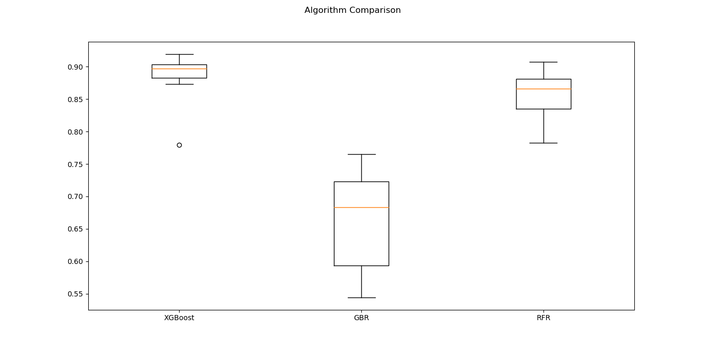
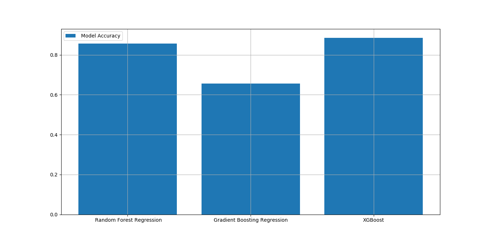
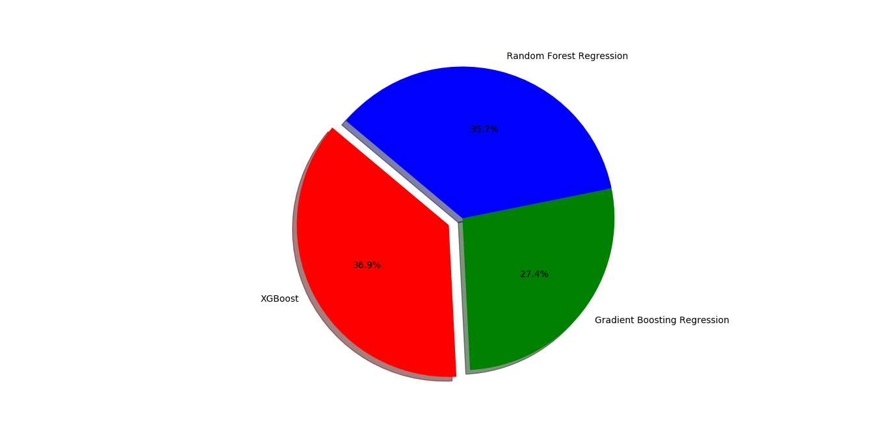
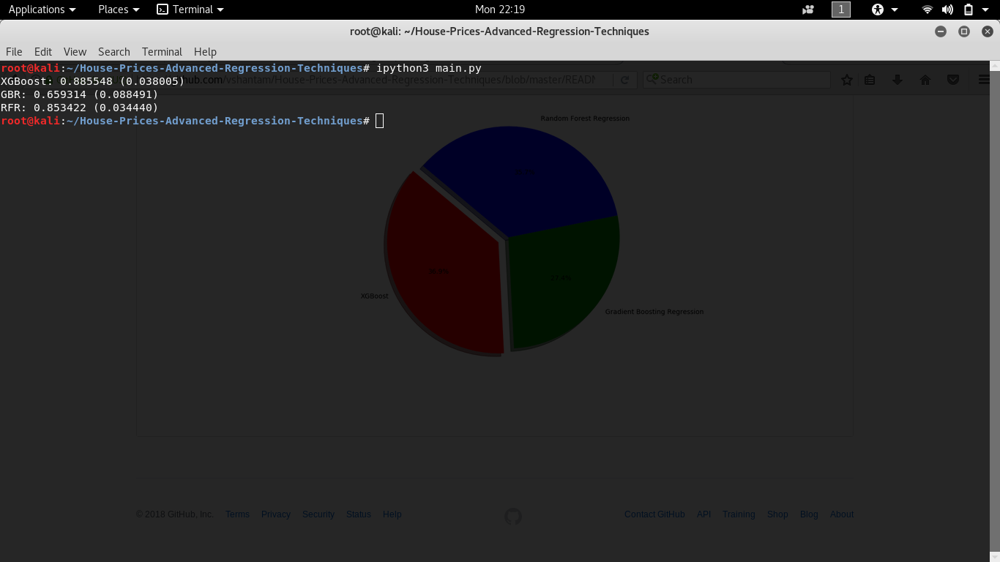
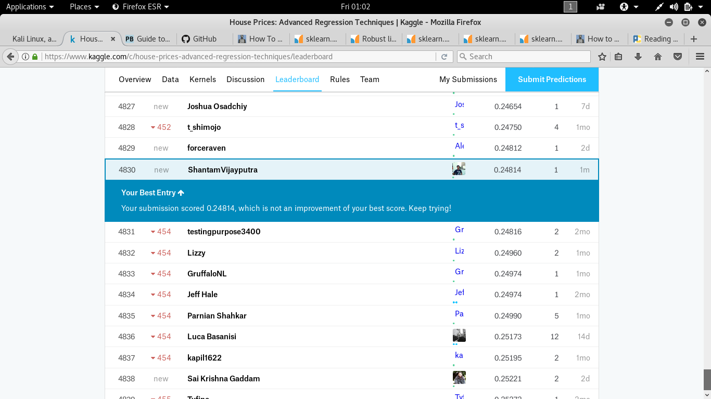
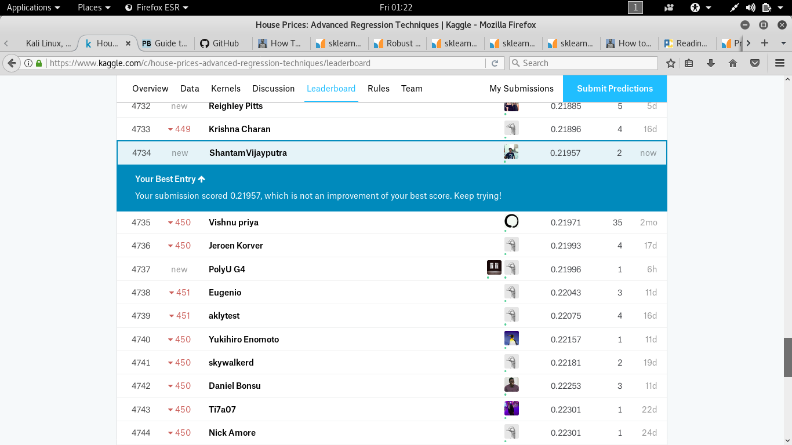
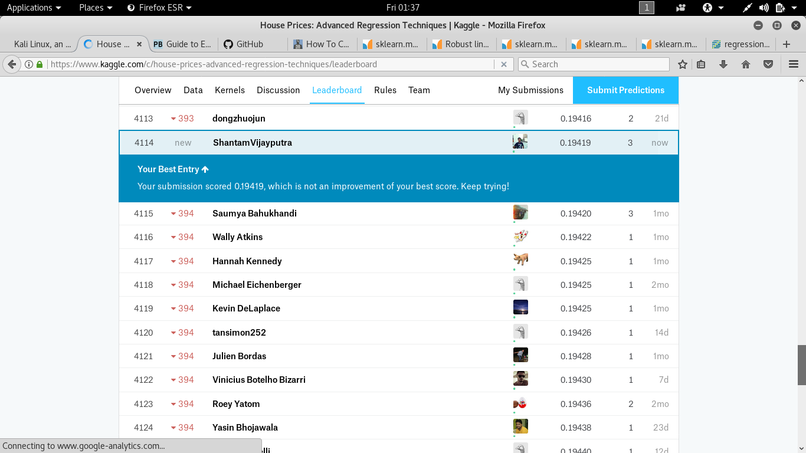

# House-Prices-Advanced-Regression-Techniques

Predict sales prices and practice feature engineering, RFs, and gradient boosting

<b><h1>Introduction:</h1></b>

This project is based on Kaggel Challage i.e to predict the house prices based of lots of features  using advance techniques of <b>Machine Learning </b> algorithms.

<b>Link: </b> https://www.kaggle.com/c/house-prices-advanced-regression-techniques

<b> <h1>Advanced Learning Regression Algorithm</h1> </b>

In This project we are going to use some of the advanced learning algorithm to predict the housing prices. Because it is not easy task to fit the model from training data who has more than 80 features of single house, so we need to work with more complexity such as <b>cleaning</b> the data, <b>label encoding</b>, <b>one hot encoding</b> , <b>dimensionality reduction</b>, <b>features scaling</b> etc.

Hence, based on there Accuracy and the r2_score we will be desciding which algorithm is best for fitting the model in this case.

there are few algorithms which we are going to discuss here such as:
		
		1-XGBOOST
		2-GRADIENT BOOSTING REGRESSION
		3-RANDOM FOREST REGRESSOR

## XGBOOST

XGBoost is an algorithm that has recently been dominating applied machine learning and Kaggle competitions for structured or tabular data.

XGBoost is an implementation of gradient boosted decision trees designed for speed and performance.

It is an implementation of gradient boosting machines created by Tianqi Chen, now with contributions from many developers. It belongs to a broader collection of tools under the umbrella of the Distributed Machine Learning Community or DMLC who are also the creators of the popular mxnet deep learning library.

### Model Features

The implementation of the model supports the features of the scikit-learn and R implementations, with new additions like regularization. Three main forms of gradient boosting are supported:

	
		1-Gradient Boosting algorithm also called gradient boosting machine including the learning rate.
		2-Stochastic Gradient Boosting with sub-sampling at the row, column and column per split levels.
		3-Regularized Gradient Boosting with both L1 and L2 regularization.

## Gradient Boosting Regression

Gradient boosting is a machine learning technique for regression and classification problems, which produces a prediction model in the form of an ensemble of weak prediction models, typically decision trees. It builds the model in a stage-wise fashion like other boosting methods do, and it generalizes them by allowing optimization of an arbitrary differentiable loss function.

## How Gradient Boosting Works

Gradient boosting involves three elements:

    A loss function to be optimized.
    A weak learner to make predictions.
    An additive model to add weak learners to minimize the loss function.

##  Random Forest Regressor

A random forest regressor.

A random forest is a meta estimator that fits a number of classifying decision trees on various sub-samples of the dataset and use averaging to improve the predictive accuracy and control over-fitting. The sub-sample size is always the same as the original input sample size but the samples are drawn with replacement if bootstrap=True (default).

	
# Which model is better ?

Based on model evaluation we can easily determine which algorithm to use or not to use..

Dendogram representation

		x-axis "Model algorithm"
		y-axis "Model evaluation score"	

Bar Graph

Pie chart

# Sample screenshot of model evaluation accuracy

run the following command

got to the project directory 

		cd House-Prices-Advanced-Regression-Techniques/

run evaluate_model.py using below commands

		ipython3 evaluate_model.py #for ipython3 version ,if you are using ipython3 
		python3  evaluate_model.py #if you are using python 3 interface

# Evaluation Outcome

run the following command:

		ipython3 evaluate_model.py #for ipython3 version

As you can see the most accurate reasult i got using XGBoost algorithm i.e 

		XGBoost: 0.885548 (0.038005)

the accuracy of the other were quite less comparatively

		GBR: 0.659314 (0.088491)
		RFR: 0.853422 (0.034440)

To run the main program for test data, use the following command:

		ipython3 driver.py #will generate the output in the terminal

# Kaggle submission 

As i mentioned earlier, this project is based on kaggle based challange, and this is my first challange so, i will not bother about the accuracy rather than the implementation and evaluation that i learned during the completion of this task.

## Screenshot for kaggle submission using :

	XGBOOST	

	Gradient Boosting Regression

	Random Forest REgressor

# Conclusion

As you can see in the screenshot the scoe is better using Random Forest Regressor even though the accuracit is less comapretively to the XGBoost regresor.

<B> Kaggle Score :</B> 4114
<B> Kaggle Percencitle : </B> 77%

